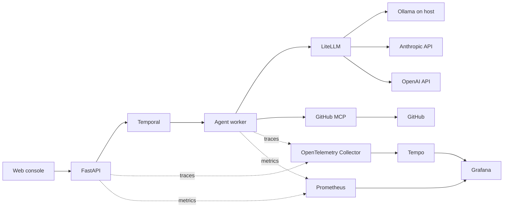

# repo_agent

`repo_agent` is a local-first foundation for durable AI agent workflows. It combines a
FastAPI web/API surface, Temporal orchestration, a LiteLLM model gateway, Ollama local
inference, and a complete local observability stack.

The workflow accepts a text task, discovers tools from GitHub's official MCP server, runs
each external call as a Temporal Activity, and stores the durable result. MCP provides a
standard capability layer for repository contents, commits, issues, pull requests, users,
and additional GitHub toolsets without requiring a new Activity for each operation.

## What It Provides

- A browser console for submitting tasks and reviewing recent results
- Durable workflow execution with retries and persisted state
- Selectable local Ollama, hosted Anthropic, and hosted OpenAI inference through LiteLLM
- Workflow status and result APIs
- Extensible GitHub tools through the official remote GitHub MCP server
- Read-only operation by default with explicit worker-level and per-run write gates
- Prometheus metrics, OpenTelemetry traces, and a provisioned Grafana dashboard
- Containerized local infrastructure with persistent service data

## Architecture



See [Architecture](docs/architecture.md) for component responsibilities, request flow,
durability boundaries, and extension guidance.

## Prerequisites

- Docker Desktop with Docker Compose v2
- Ollama running on macOS
- Enough memory and disk for the selected model
- `uv` for host-side Python development
- `jq` for the optional command-line examples

The default `qwen3.8:27b` model uses about 17 GB on disk. Select a smaller Ollama model
through `LOCAL_MODEL` when the host cannot run it comfortably.

## Quick Start

1. Install and start Ollama, then pull the configured model:

	```bash
	brew install ollama
	brew services start ollama
	ollama pull qwen3.8:27b
	ollama pull qwen3:8b
	```

2. Create the local environment file, add a fine-grained GitHub token, and start the stack:

	```bash
	cp .env.example .env
	# Edit GITHUB_TOKEN in .env
	docker compose up --build -d
	```

3. Open the agent console:

	**http://localhost:8000/**

Enter a task, choose a model, and select **Run agent**. The model menu is populated from
LiteLLM's live catalog. The console displays workflow state, model output, and browser-local
history. Temporal persists workflow state independently of that browser history.

The checked-in aliases are `agent-default` for the `LOCAL_MODEL` Ollama tag,
`agent-qwen3-8b` for local `qwen3:8b`, `agent-anthropic` for `ANTHROPIC_MODEL`, and
`agent-openai` for `OPENAI_MODEL`. Set the corresponding provider API key in `.env`
before using a hosted option. Selection is manual per run; automatic cross-provider
fallback is not enabled.

Try a repository activity question:

```text
Which repo has the most commits in the past 12 months under user zyan8808?
```

The non-interactive worker authenticates to `https://api.githubcopilot.com/mcp/` with
`GITHUB_TOKEN`. The token is passed only to the worker and is never included in model
messages or Temporal workflow inputs. Grant only the GitHub permissions the agent needs.

## Use the API

List the model aliases currently advertised by LiteLLM:

```bash
curl --fail --silent http://localhost:8000/models | jq .
```

Start a workflow with a selected alias:

```bash
response=$(curl --fail --silent --show-error \
  -X POST http://localhost:8000/runs \
  -H 'Content-Type: application/json' \
	-d '{"prompt":"Explain the architecture of this agent service","model":"agent-qwen3-8b"}')

workflow_id=$(printf '%s' "$response" | jq -r '.workflow_id')
printf '%s\n' "$workflow_id"
```

Check its state and retrieve the result:

```bash
curl --fail --silent "http://localhost:8000/runs/$workflow_id" | jq .
curl --fail --silent "http://localhost:8000/runs/$workflow_id/result" | jq .
```

The result request waits for a running workflow to finish. A failed workflow returns HTTP
`409`; invalid requests use standard FastAPI validation responses.

## Local Services

| Service | Purpose | URL |
| --- | --- | --- |
| Agent console | Submit and inspect agent runs | http://localhost:8000/ |
| API documentation | Interactive OpenAPI documentation | http://localhost:8000/docs |
| Temporal UI | Workflow history and Activity attempts | http://localhost:8080 |
| LiteLLM | OpenAI-compatible local model gateway | http://localhost:4000 |
| Grafana | Provisioned project dashboard and trace exploration | http://localhost:3000/d/repo-agent-overview/repo-agent-overview |
| Prometheus | Metrics queries and target health | http://localhost:9090 |

## Documentation

- [Architecture](docs/architecture.md): components, execution flow, durability, and extension points
- [Operations and configuration](docs/operations.md): environment variables, lifecycle commands, APIs, and troubleshooting
- [Metrics and observability](docs/metrics.md): telemetry pipeline, metric reference, PromQL examples, dashboards, and traces

## Development

Install dependencies and run the project checks:

```bash
uv sync
uv run pytest
uv run ruff check src tests
uv run pyright
```

The main code is organized as follows:

```text
src/repo_agent/
  api.py          HTTP API, web console, and API metrics
  workflows.py    deterministic Temporal workflow definitions
  activities.py   model inference and generic MCP client Activities
  worker.py       Temporal worker process
  telemetry.py    OpenTelemetry trace configuration
  settings.py     environment-backed application settings
configs/          LiteLLM, Prometheus, Tempo, Grafana, and collector config
docs/             architecture, operations, and observability guides
tests/            automated tests
```

## Design Rules

- Keep Temporal workflow code deterministic.
- Put model calls, file access, Git operations, and other side effects in Activities.
- Do not automatically retry mutating MCP tool calls.
- Require both worker configuration and per-run authorization for GitHub writes.
- Validate repository paths and command inputs before adding repository execution tools.
- Keep secrets in `.env` or a secret manager; `.env` is intentionally ignored by Git.

## Stop or Reset

Stop containers while preserving data:

```bash
docker compose down
```

Delete containers and all local service volumes:

```bash
docker compose down -v
```

The second command permanently removes local Temporal history, Prometheus data, Grafana
state, Tempo traces, and PostgreSQL data. See [Operations and configuration](docs/operations.md)
for safer service-specific commands and troubleshooting steps.