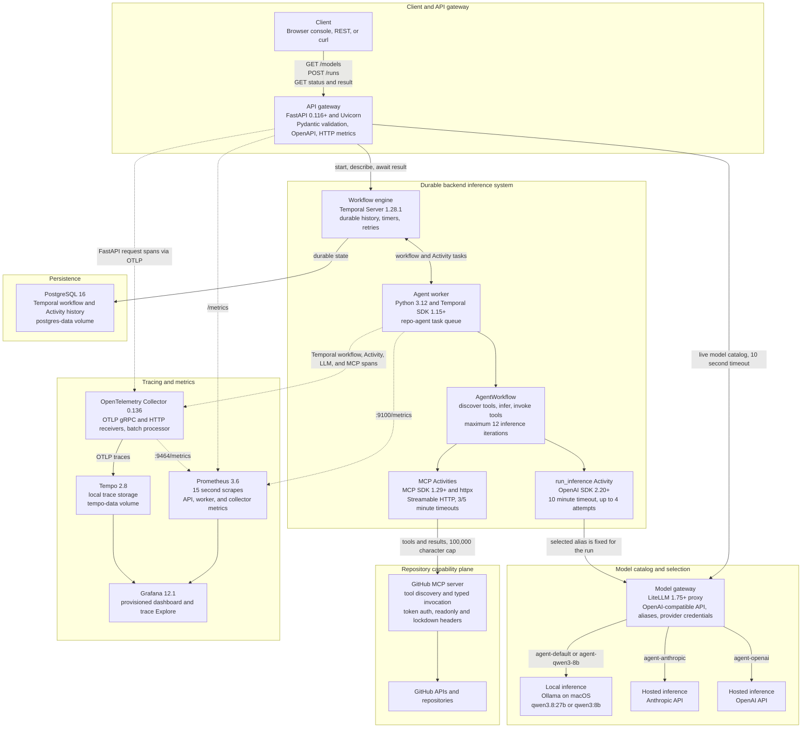

# Architecture

`repo_agent` is a local-first, durable repository agent. FastAPI is the synchronous
control plane, Temporal is the durable execution plane, a Python worker runs all side
effects, LiteLLM selects an inference provider, and GitHub MCP supplies typed repository
capabilities. Prometheus, OpenTelemetry, Tempo, and Grafana provide local operational
visibility.

## System Flow

Solid arrows carry requests, tasks, model messages, tool results, or persisted state.
Dotted arrows carry telemetry. The deployment is local by default: containers communicate
on the Compose network, published ports bind to `127.0.0.1`, and Ollama runs on the host.

## Component Responsibilities

| Component | Technology | Responsibility | State and scaling boundary |
| --- | --- | --- | --- |
| Client | Static HTML/JavaScript console or any HTTP client | Discover models, submit work, poll state, and retrieve results | Console history is browser-local; clients can scale independently |
| API gateway | FastAPI, Uvicorn, Pydantic, httpx | Validate requests, proxy model discovery, start and query workflows, expose HTTP metrics | Stateless after startup except for its Temporal client; add replicas behind a load balancer |
| Workflow engine | Temporal Server 1.28.1 | Persist execution history, replay deterministic workflow code, schedule Activities, and enforce retries | Scales separately from workers; PostgreSQL is its durable dependency |
| Agent worker | Python 3.12, Temporal SDK 1.15+ | Poll the task queue and execute workflow code, inference, and MCP Activities | Stateless compute; add workers for throughput and task-queue concurrency |
| Model gateway | LiteLLM 1.75+ | Publish aliases and route OpenAI-compatible requests to local or hosted providers | Central routing and credential boundary; currently one Compose instance |
| Local inference | Ollama on macOS | Serve local Qwen models without sending prompts to a hosted provider | Bound by host RAM, model size, and accelerator throughput |
| Hosted inference | Anthropic and OpenAI APIs | Optional remote inference selected by alias | External latency, quota, availability, privacy, and cost boundary |
| Capability plane | GitHub MCP, MCP Python SDK 1.29+, Streamable HTTP | Discover typed GitHub tools and execute authenticated calls | External service boundary; narrowed by toolsets and write controls |
| Workflow database | PostgreSQL 16 | Persist Temporal workflow history and Activity results | Recovery-critical state; local single instance is not highly available |
| Metrics | prometheus-client and Prometheus 3.6 | Export and retain application, process, and collector time series | Pull-based, local volume retention, 15-second resolution |
| Tracing | Temporal OpenTelemetry interceptor, OpenTelemetry Collector 0.136, and Tempo 2.8 | Propagate API context through workflows and Activities, retain spans, and support trace queries | Local storage and default sampling favor development over high-volume retention |
| Visualization | Grafana 12.1 | Provision dashboards and query Prometheus and Tempo | Local anonymous Admin mode is development-only |

## End-to-End Request Walkthrough

1. The console calls `GET /models`. FastAPI requests LiteLLM's `/v1/models` endpoint with
   a ten-second HTTP timeout and returns aliases with `agent-default` first.
2. The client sends `POST /runs` with a prompt, model alias, and optional write intent.
   Pydantic limits prompts to 100,000 characters and model IDs to 200 characters.
3. FastAPI rechecks the live model catalog. An unavailable catalog returns `503`; an
   unknown alias returns `400`. A valid request receives a `repo-agent-<uuid>` ID.
4. FastAPI starts `AgentWorkflow` on the `repo-agent` Temporal task queue and returns
   `202 Accepted`. The client is no longer coupled to the execution lifetime.
5. The workflow schedules `list_mcp_tools` with a three-minute start-to-close timeout and
   a four-attempt exponential retry policy. If no GitHub token exists, it returns an empty
   catalog and the run can still answer without tools.
6. The worker connects to GitHub MCP over Streamable HTTP, initializes a session, follows
   pagination, and converts each MCP schema into an OpenAI function definition.
7. The workflow schedules `run_inference` with the selected alias, accumulated messages,
   and current tool schemas. LiteLLM resolves the alias to Ollama, Anthropic, or OpenAI.
8. A final text response completes the workflow. Tool calls are validated against the
   discovered catalog, parsed as JSON objects, and executed through `call_mcp_tool`.
9. Tool results are serialized into workflow history and fed back to the model. Results
   larger than 100,000 characters are truncated before entering the next inference step.
10. The infer/tool loop runs at most 12 times. Exceeding the limit or returning neither
    text nor tool calls fails the workflow. `GET /runs/{id}/result` maps a Temporal workflow
    failure to HTTP `409`.

Multiple tool calls returned by one model response are executed sequentially. This keeps
history ordering simple and predictable, but increases latency when independent reads
could have run concurrently.

## Durability and Consistency

The `AgentRequest`, including the selected model alias and write intent, is Temporal
workflow input. Tool schemas, model responses, and MCP results become workflow history.
After a worker restart, Temporal replays that history and resumes from the next unresolved
command rather than repeating completed workflow code.

Workflow code must remain deterministic. It may use Temporal-safe APIs such as
`workflow.now()`, but must not directly read files, generate unmanaged randomness, make
network calls, or execute commands. Those side effects belong in Activities.

The execution guarantee is best described as durable orchestration with at-least-once
Activity execution, not exactly-once side effects:

- Inference Activities and MCP Activities in read-only mode may be attempted up to four
   times after failures.
- Inference retries can incur additional provider latency or cost, but do not directly
  mutate GitHub state.
- Once write access is enabled, MCP calls use one attempt to avoid replaying a mutation
  after an ambiguous timeout.
- A single attempt does not prove exactly-once execution: the remote write may succeed
  even if its response is lost. Production mutations still need provider-supported
  idempotency keys or a reconciliation step.

## Model Selection

LiteLLM separates the agent from provider-specific APIs. The API reads the live catalog,
and the workflow stores one alias for the entire run. Retries and later tool iterations
therefore preserve the user's choice.

| Alias | Target | Main benefit | Main cost |
| --- | --- | --- | --- |
| `agent-default` | `LOCAL_MODEL` through Ollama | Private, local, and no per-token fee | Host resource pressure and variable latency |
| `agent-qwen3-8b` | `qwen3:8b` through Ollama | Smaller local footprint | Lower capability than larger models |
| `agent-anthropic` | Configured Anthropic model | Hosted capacity and strong tool use | External data boundary, quota, and cost |
| `agent-openai` | Configured OpenAI model | Hosted capacity and OpenAI compatibility | External data boundary, quota, and cost |

The checked-in configuration intentionally has no automatic fallback. A provider failure
is visible instead of silently moving repository context across trust or billing
boundaries. A production router could add health-aware fallback, but should require an
explicit policy for privacy, cost ceilings, and whether model changes within one durable
run are acceptable.

Each request carries token and estimated-cost limits, defaulting to 100,000 tokens and
$5.00. The workflow accumulates provider-reported usage after every inference; if usage is
absent, the Activity estimates tokens and marks the final result accordingly. Pricing uses
the resolved provider model when LiteLLM knows it, explicit hosted-alias fallbacks when it
does not, and explicit zero per-token cost for local Ollama aliases. Limits are checked
after each successful call, so they stop continued execution but cannot prevent one call
from crossing a threshold. Failed retries can also have unreported provider charges.

## Security Boundaries

Provider credentials exist only in the LiteLLM container. The GitHub token exists only in
the worker. Neither credential is workflow input or part of a model message.

GitHub writes require two independent gates: the worker must start with
`MCP_ALLOW_WRITES=true`, and the request must carry `allow_writes=true`. The worker sends
the resulting mode through `X-MCP-Readonly`; it also sends configured toolsets and the
default-on lockdown header. The system prompt treats tool output as untrusted data.

These controls reduce accidental writes and prompt-injection exposure, but they are not a
complete authorization system. Public deployment would additionally require API
authentication, per-user authorization, rate limiting, audit logs, network TLS, secret
management, and replacement of Grafana's anonymous Admin access.

## Observability Boundary

FastAPI request middleware records counts and latency using route templates, avoiding a
unique Prometheus label for every workflow ID. Inference metrics measure each Activity
attempt, so retries are visible as separate successes or failures. Prometheus scrapes the
API, worker, and collector every 15 seconds.

FastAPI is explicitly instrumented and sends request spans over OTLP/gRPC to the collector.
Temporal's OpenTelemetry interceptor injects that context into workflow headers and
extracts it in the worker, producing client, workflow, and Activity spans. Inference and
MCP Activities add child spans around their external operations without recording prompts,
tool results, or credentials. The collector batches and forwards spans to Tempo.

Prometheus also records bounded inference token, estimated-cost, usage-gap, and MCP
operation metrics. Tool names stay in traces rather than metric labels to avoid
cardinality growth. Metric definitions and trace troubleshooting live in
[Metrics and observability](metrics.md).

## Design Tradeoffs

| Decision | Why it fits now | Cost or risk | Scale-up alternative |
| --- | --- | --- | --- |
| Temporal for orchestration | Durable retries and inspectable history fit long-running agent tasks | More infrastructure and deterministic-code constraints | A simple queue is cheaper for short, stateless jobs; keep Temporal when resumability matters |
| PostgreSQL for Temporal | Familiar durable backend with a persistent local volume | Single local instance is a recovery and throughput bottleneck | Managed PostgreSQL, backups, connection pooling, and Temporal production topology |
| Runtime MCP discovery | Tool changes do not require application deployment | One remote discovery step per run and larger workflow inputs | Cache schemas with a version/TTL while preserving a refresh path |
| Sequential tool calls | Deterministic ordering and simpler conversation history | Higher latency for independent calls | Execute proven read-only calls concurrently and preserve stable result ordering |
| LiteLLM gateway | One API and alias layer for local and hosted models | Extra hop and central point of failure | Replicated gateway, health checks, budgets, and policy-controlled routing |
| Manual model selection | Predictable privacy, capability, and cost per run | No automatic recovery from provider failure | Explicit fallback groups constrained by data-classification policy |
| Pull-based Prometheus metrics | Simple local operations and mature PromQL | Scrape delay and local retention only | Remote write to managed long-term storage |
| Local Tempo storage | Low setup cost and easy trace exploration | Volume loss removes history; no HA | Object storage, retention policy, and replicated Tempo deployment |
| Browser polling | Simple client and stateless API | Repeated HTTP traffic and delayed updates | Server-sent events or WebSockets backed by Temporal queries/signals |
| Temporal trace propagation | Connects API, workflow, Activity, LLM, and MCP spans | More spans and local storage consumption | Tail sampling and retention policy at higher throughput |

## Failure Modes and Recovery

| Failure | Observed behavior | Recovery or mitigation |
| --- | --- | --- |
| LiteLLM catalog unavailable | New runs fail fast with `503` | Restore LiteLLM or provider config; existing Temporal runs may still be retrying inference |
| Selected provider unavailable | Inference Activity retries up to four times, then the workflow fails | Restore the provider or start a new run with another alias |
| GitHub MCP unavailable | Discovery or tool Activities retry within their timeout policy | Check token, remote service, toolsets, and worker connectivity |
| Worker stopped | Temporal retains pending work; no Activities progress | Restart or add workers polling the same task queue |
| Temporal unavailable | API startup or workflow operations fail | Restore Temporal and its PostgreSQL dependency |
| PostgreSQL unavailable | Temporal cannot durably advance workflows | Restore the database; use backups and HA for production |
| Oversized tool response | Worker truncates the serialized result at 100,000 characters | Add pagination or narrower tools rather than raising the cap blindly |
| Tool loop does not converge | Workflow fails after 12 inference iterations | Improve prompts/tool schemas or split the task into child workflows |
| Process exits before trace flush | Batched spans may be lost | Graceful shutdown and explicit provider shutdown hooks |

## Scaling Path

Scale the bottleneck that telemetry demonstrates rather than scaling every container:

1. Add API replicas when HTTP saturation appears; API state is already externalized.
2. Add workers on the same task queue when Temporal schedule-to-start latency grows.
3. Use separate task queues for inference and repository operations when their concurrency
   or resource profiles diverge.
4. Add per-provider concurrency controls and rate-limit handling before increasing worker
   count, otherwise workers can amplify upstream throttling.
5. Cache MCP schemas only after measuring discovery latency, and version the cache so tool
   changes cannot silently break durable runs.
6. Move PostgreSQL, Prometheus retention, and Tempo blocks to backed-up or managed storage
   before treating the system as production infrastructure.
7. Add token, cost, queue-latency, MCP-latency, and end-to-end workflow metrics before
   making automated routing or capacity decisions.

The current Compose deployment prioritizes understandable local behavior over high
availability. Its most important production gaps are API authentication, durable workflow
outcome metrics, mutation idempotency, rate limiting, durable backups, and provider-aware
capacity management.

## Persisted Local Data

| Volume | Owner | Data |
| --- | --- | --- |
| `postgres-data` | PostgreSQL and Temporal | Workflow history, Activity results, and retry state |
| `prometheus-data` | Prometheus | Scraped time-series history |
| `tempo-data` | Tempo | Trace WAL and blocks |
| `grafana-data` | Grafana | Local database, preferences, and provisioned state |

`docker compose down` preserves these volumes. `docker compose down -v` deletes all four.