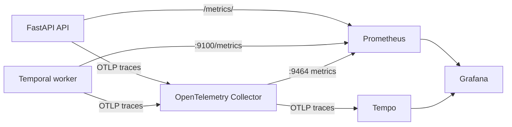

# Metrics and Observability

The local observability stack combines Prometheus metrics, OpenTelemetry traces, Grafana
visualization, and Tempo trace storage.

## Data Flow



Prometheus scrapes every 15 seconds. Application metrics are exposed directly by the API
and worker; traces travel through the OpenTelemetry Collector to Tempo.

## Endpoints

| Surface | URL |
| --- | --- |
| Grafana project dashboard | http://localhost:3000/d/repo-agent-overview/repo-agent-overview |
| Prometheus UI | http://localhost:9090 |
| Prometheus targets | http://localhost:9090/targets |
| API metrics | http://localhost:8000/metrics/ |
| Worker metrics | http://localhost:9100/metrics |
| Collector metrics | http://localhost:9464/metrics |
| Tempo API | http://localhost:3200 |

Grafana uses anonymous local Admin access and provisions Prometheus and Tempo data sources
at startup. This configuration is intended for local development only.

## Project Metric Reference

### API Metrics

| Metric | Type | Labels | Meaning |
| --- | --- | --- | --- |
| `repo_agent_http_requests_total` | Counter | `method`, `route`, `status` | Requests completed by the FastAPI service |
| `repo_agent_http_request_duration_seconds` | Histogram | `method`, `route` | End-to-end API request duration |
| `repo_agent_workflows_started_total` | Counter | none | Workflows accepted by `POST /runs` |

The `route` label uses route templates such as `/runs/{workflow_id}` rather than concrete
workflow IDs. This prevents unbounded Prometheus label cardinality. Requests handled by a
mounted ASGI application or redirects may appear as `unmatched`.

### Worker Metrics

| Metric | Type | Labels | Meaning |
| --- | --- | --- | --- |
| `repo_agent_inference_calls_total` | Counter | `model`, `status` | Inference Activity outcomes, where status is `success` or `error` |
| `repo_agent_inference_duration_seconds` | Histogram | `model` | Time spent waiting for LiteLLM inference |

Activity retries produce a metric event for each attempt. An eventual workflow success may
therefore coexist with earlier inference errors.

### Runtime Metrics

The Python Prometheus client also publishes process and interpreter metrics, including:

- `process_resident_memory_bytes`
- `process_cpu_seconds_total`
- `process_open_fds`
- `python_gc_collections_total`
- `python_gc_objects_collected_total`

Use the Prometheus `job` label to distinguish `repo-agent-api` and `repo-agent-worker`.

## Grafana Dashboard

The provisioned **repo_agent overview** dashboard contains:

- API and worker scrape health
- Workflows started in the selected range
- API 5xx response count
- Successful inference count
- Inference p95 latency
- API request rate by method, route, and status
- API p95 latency by route
- Inference outcomes by status
- API and worker resident memory

The default time range is one hour and panels refresh every ten seconds. Newly created
counter series may need two Prometheus scrapes before range functions such as `rate()` or
`increase()` display a value.

Dashboard provisioning is defined by:

- `configs/grafana-datasources.yaml`
- `configs/grafana-dashboards.yaml`
- `configs/dashboards/repo-agent-overview.json`

After editing a provisioned dashboard file, recreate Grafana:

```bash
docker compose up -d --force-recreate grafana
```

## Useful PromQL

Service target health:

```promql
up{job=~"repo-agent-api|repo-agent-worker|otel-collector"}
```

API request rate by route and status:

```promql
sum by (method, route, status) (
  rate(repo_agent_http_requests_total{route!="unmatched"}[5m])
)
```

API p95 latency:

```promql
histogram_quantile(
  0.95,
  sum by (le, method, route) (
    rate(repo_agent_http_request_duration_seconds_bucket[5m])
  )
)
```

Workflow submissions in the last hour:

```promql
sum(increase(repo_agent_workflows_started_total[1h]))
```

Inference attempts by outcome:

```promql
sum by (status) (increase(repo_agent_inference_calls_total[1h]))
```

Inference p95 latency:

```promql
histogram_quantile(
  0.95,
  sum by (le) (rate(repo_agent_inference_duration_seconds_bucket[5m]))
)
```

Resident memory by application process:

```promql
process_resident_memory_bytes{job=~"repo-agent-api|repo-agent-worker"}
```

## Traces

FastAPI and the worker configure OTLP trace exporters with service names
`repo-agent-api` and `repo-agent-worker`. The collector exports those traces to Tempo.

Use Grafana **Explore**, select the Tempo data source, and filter by service name. Trace
retention is local and follows the lifecycle of the `tempo-data` Docker volume.

## Populate the Dashboard

Start one workflow through the web console or API. A completed run creates workflow and
inference metrics, while normal console polling creates API traffic metrics. Wait at least
one scrape interval before evaluating range queries.

For a lightweight API-only sample:

```bash
for endpoint in health health health openapi.json; do
  curl --fail --silent --output /dev/null "http://localhost:8000/$endpoint"
done
```

## Troubleshooting Empty Panels

1. Confirm all targets are `UP` at http://localhost:9090/targets.
2. Query the metric name directly in Prometheus before debugging Grafana.
3. Expand Grafana's time range and allow at least two scrape intervals for rate panels.
4. Run an agent workflow to create inference and workflow series.
5. Check provisioning and scrape logs:

   ```bash
   docker compose logs --tail=100 grafana prometheus otel-collector
   ```

6. Confirm the application endpoints expose data:

   ```bash
   curl --fail http://localhost:8000/metrics/
   curl --fail http://localhost:9100/metrics
   ```

If Grafana has no dashboard at all, recreate it so file provisioning runs. Do not delete
`grafana-data` unless losing local Grafana state is acceptable.